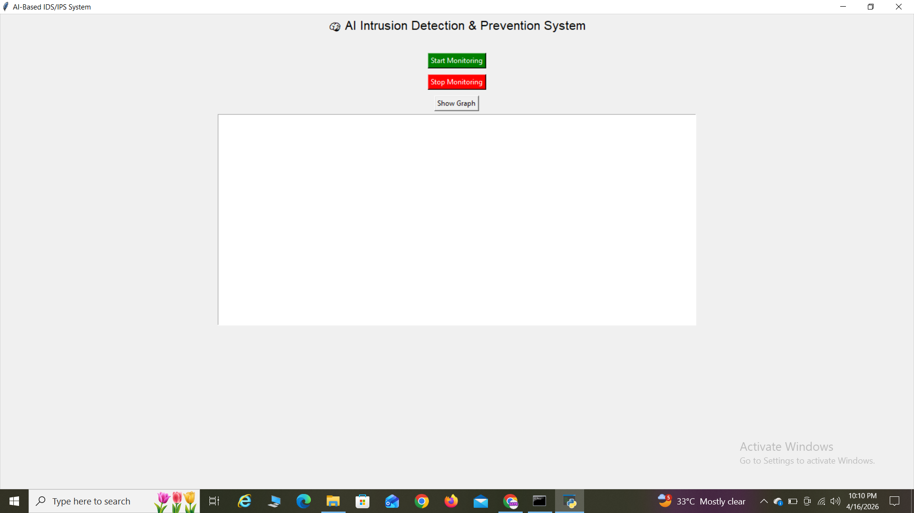
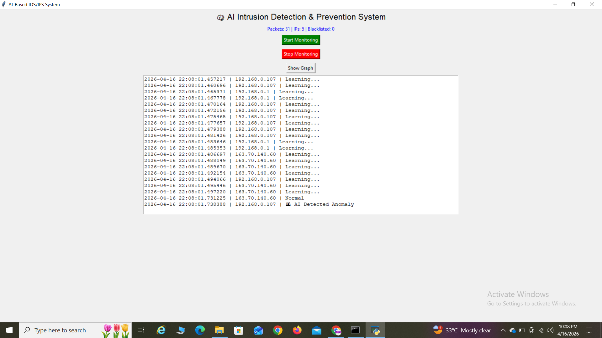
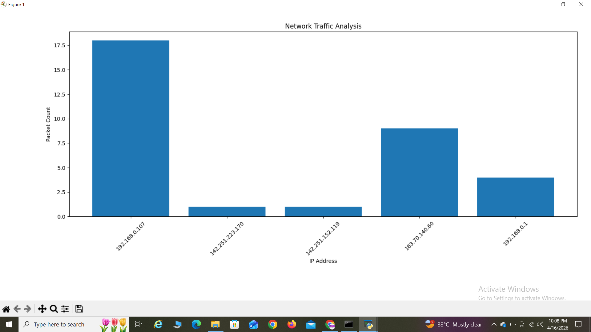
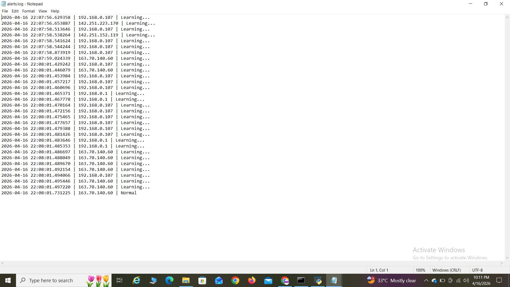

## AI-Based Intrusion Detection & Prevention System (AI IDS/IPS)

## Description

This project is an AI-powered Intrusion Detection and Prevention System that monitors network traffic in real time, detects anomalies using machine learning, and automatically blocks suspicious IP addresses.

## Features

- Real-time packet capture using Scapy
- AI-based anomaly detection using Isolation Forest
- Automated IP blacklisting (IPS functionality)
- GUI-based dashboard using Tkinter
- Network traffic visualization using Matplotlib
- Logging system for security events

## Key Highlights

- Integrated Machine Learning with cybersecurity for anomaly detection
- Implemented real-time packet monitoring and threat detection
- Designed automated defense mechanism using IP blacklisting
- Built interactive GUI dashboard for live monitoring
- Combined IDS (Detection) and IPS (Prevention) capabilities

## Demo

# Dashboard

 # AI Detection

#  Traffic Graph

##  Sample Output

## Technologies Used
- Python
- Scapy
- Tkinter
- Matplotlib
- Scikit-learn

##  How to Run

1. Install dependencies:

pip install scapy matplotlib scikit-learn numpy

2. Run the program:

python ai_ids.py

## Project Structure

- ai_ids.py → Main application
- blacklist.txt → Stores blocked IPs
- alerts.log → Security logs
- screenshots/ → Demo images

## Note

This project is developed for educational purposes and simulates intrusion detection and prevention behavior using AI.

## Author
Mohd Ehsaan Muzammil
